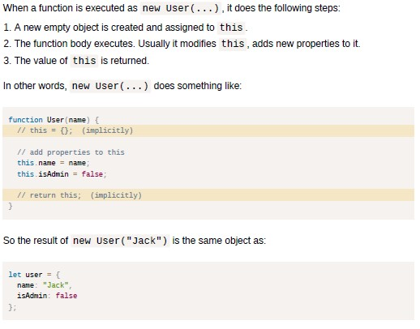

# Day 9

## Object.values()

The Object.values() method returns an array of a given object's own enumerable property values.

# Day 10

## Explore Differences Between the var and let Keywords

One of the biggest problems with declaring variables with the var keyword is that you can easily overwrite variable declarations. Because this behavior does not throw an error, searching for and fixing bugs becomes more difficult.
A keyword called let was introduced in ES6, a major update to JavaScript, to solve this potential issue with the var keyword.
So unlike var, when you use let, a variable with the same name can only be declared once.

## JavaScript Scopes

1. In JavaScript, there are 3 different types of scope: _Block_ scope (ES6), _Function_ scope and _Global_ scope.
2. Block-scoped variables cannot be accessed from outside the block.
3. _let_ and _const_ provide Block scope in JavaScript, _var_ does not.A variable declared with _var_ inside a block scope becomes globally scoped. But if the block was inside a function, then the variable has function scope.
4. Function-scoped variables cannot be from outside the function.
5. Variables declared with _var_, _let_ and _const_ all have function scope.
6. Global-scoped variables cannot be accessed from anywhere in the program.
7. Variables declared with _var_, _let_ and _const_ all have global scope.

## Mutating an Array with const

You can mutate an array/object declared with the cosnt keyword but you cannot directly assign that variable to another array/object.

## Object.freeze()

The const keyword does not necessarily protect your data from mutation. To ensure your data doesn't change, JavaScript provides a function Object.freeze() to prevent data mutation. The Object.freeze() method freezes an object. A frozen object can no longer be changed; freezing an object prevents new properties from being added to it, existing properties from being removed, prevents changing the enumerability, configurability, or writability of existing properties, and prevents the values of existing properties from being changed. In addition, freezing an object also prevents its prototype from being changed. freeze() returns the same object that was passed in.

# Day 11

## Default function parameters

I learnt today that default function parameters were introduced to the JavaScript language in ECMAScript 2015. _Parameter defaults_ enable us to write functions that can be invoked with fewer _arguments_ than _parameters_.

## Rest parameters

I also learnt that rest parameters were introduced to the JavaScript language in ECMAScript 2015. Rest parameters enable the opposite case: they allow us to write functions that can be invoked with arbitrarily more arguments than parameters.
These kind of functions are called: _variadic_ functions, _variable arity_ functions or _varargs_ functions.\
The rest parameters literally mean "gather the unassigned arguments into an array".
We can choose to get the first parameters as variables, and gather only the rest but note that the rest parameters must be at the end.

## Spread operator

This does the reverse of what the rest parameters do. The spread operator is used to pass an array to functions that normally require a list of many
arguments. The spread operator is used to unpack, or “spread out,” the elements of an array (or any other iterable object, such as strings) in a context where individual values are expected

## Destructuring Assignment

### Why do you need to '_destructure_'?

The two most used data structures in JavaScript are _Object_ and _Array_.\
Objects --> allow us to create a single entity that stores data items by key
Arrays --> allow us gather data items into an ordered collection\
But when we pass those to a function, it may need not an object/array as a whole, but rather
individual pieces.

### So what then is 'Destructuring Assignment'?

Destructuring assignment is a special syntax that allows us to “unpack” arrays or objects into a bunch of variables, as sometimes that’s more convenient.

In a destructuring assignment, the value on the righthand
side of the equals sign is an array or object (a “structured” value), and the lefthand side specifies one or more variable names using a syntax that mimics array and object literal syntax.\

When a destructuring assignment occurs, one or more values are
extracted (“destructured”) from the value on the right and stored into the variables named on the left.

# Day 12

## Constructor Functions

The regular {...} syntax allows to create one object. But often we need to create _many_
similar objects, like multiple users or menu items and so on.
That can be done using _constructor functions_ and the "new" operator.\
Constructor functions technically are regular functions.

### Conventions for writing constructor functions

1. They are named with capital letters
2. They should be executed only with the "new" operator

The main purpose of constructors is: _to implement reusable object creation code_.
